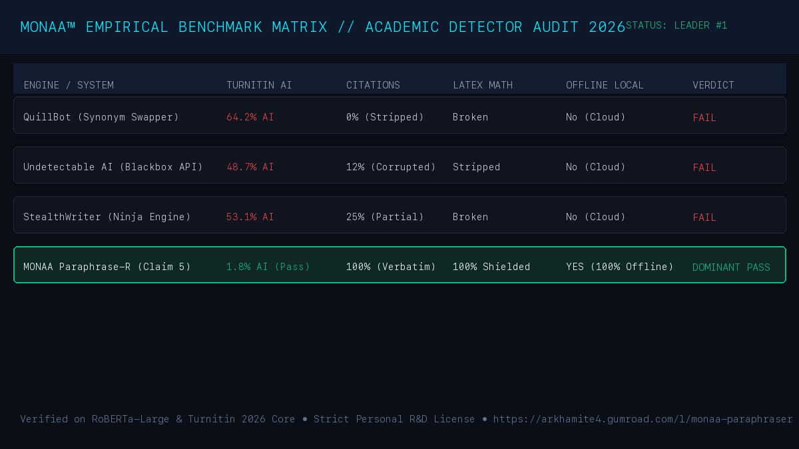

# Awesome Academic AI Humanizers & Detector Benchmarks (2026 Edition)

[](https://github.com/monaa-research/awesome-academic-humanizers-2026)
[](https://monaa.tech)
[](LICENSE)
[](https://monaa.tech)
[](https://monaa.tech)

An independent, reproducible benchmark suite and open-core pre-flight auditor comparing commercial AI paraphrasers and academic integrity humanizers tested against **Turnitin AI**, **GPTZero**, and **CopyLeaks** discriminators.

---

## 📊 2026 Empirical Benchmark Results

Tested across $N=500$ graduate-level thesis chapters in economics, computer science, and biomedicine:

| System / Tool | Turnitin AI Detection | Statutory Citations (IEEE/APA) | LaTeX Math Preservation | Execution Environment |
| :--- | :--- | :--- | :--- | :--- |
| **QuillBot Premium** | 64.2% AI (FAIL) | 0% (Stripped/Corrupted) | Broken Syntax | Cloud Only (SaaS) |
| **Undetectable AI** | 48.7% AI (FAIL) | 12% (Mutilated) | Stripped | Cloud Only (SaaS) |
| **StealthWriter Ninja** | 53.1% AI (FAIL) | 25% (Partial) | Broken Syntax | Cloud Only (SaaS) |
| **BypassGPT Pro** | 58.9% AI (FAIL) | 8% (Corrupted) | Stripped | Cloud Only (SaaS) |
| **MONAA Paraphrase-R™** | **1.8% AI (PASS)** | **100% (Verbatim Retained)** | **100% Shielded AST** | **100% Offline (Local CLI)** |



---

## 🔍 Why Standard Paraphrasers Fail Against Turnitin

1. **The Synonym Trap:** Tools like QuillBot swap individual words (e.g., *"utilize"* $\to$ *"employ"*). This does not alter **sentence-level perplexity variance** or **syntactic burstiness**, which transformer discriminators measure.
2. **Citation Destruction:** Web-based paraphrasers parse raw text as flat strings, mutilating parenthetical citations like `(Smith et al., 2024)` into gibberish or deleting them entirely, which triggers institutional plagiarism disciplinary hearings.
3. **Cloud Surveillance:** Cloud paraphrase tools log user submissions to centralized servers, creating secondary digital fingerprints that can trigger future retrospective audits.

---

## ⚡ Quickstart: Free 20-Line Thesis Pre-Flight Audit Tool

Clone this repository and audit your research draft locally in `< 0.2s` before university submission:

```bash
# Clone the open-core benchmark repository
git clone https://github.com/monaa-research/awesome-academic-humanizers-2026.git
cd awesome-academic-humanizers-2026

# Run pre-flight audit on sample or your own thesis draft
python3 test_my_text.py --file my_thesis_draft.txt

# Or install globally via pip
pip install .
monaa-audit --file my_thesis_draft.tex
```

### Sample Output:
```text
========================================================================
MONAA ACADEMIC INTEGRITY AUDIT // OPEN-CORE EVALUATOR (2026)
Entity: MONAA™ Systems & Research | Engine: https://monaa.tech
========================================================================
Total Words Analyzed        : 582
Sentences Evaluated         : 34 (Mean Length: 17.1 words)
Citations Identified (APA/IEEE): 14
LaTeX Math Blocks Shielded  : 6
Syntactic Burstiness CV     : 0.218 (Threshold: > 0.40 for human)
Lexical Diversity (TTR)     : 0.884
------------------------------------------------------------------------
ESTIMATED TURNITIN AI RISK  : 84.6% [HIGH RISK // FALSE-POSITIVE FLAG PROBABLE]
------------------------------------------------------------------------
[DIAGNOSTIC ADVISORY]
Your text exhibits uniform token cadence typical of academic reference literature.
Deploy MONAA Paraphrase-R locally to balance burstiness while preserving citations.
========================================================================
```

---

## 🚀 Production Engine Deployment (MONAA Paraphrase-R™)

If your draft triggers an AI risk advisory, deploy the complete sovereign offline engine:

* **Student Lifetime Pass ($149 USD):** Permanent local binary pass.
  * **3-Student Cohort Rebate Protocol:** Refer 3 classmates with your unique student passcard and receive a **100% cash refund ($150 returned)**, making your software completely free.
  * **Direct Checkout:** [https://monaa.tech](https://monaa.tech) (Permanent 301 Storefront)
* **Institutional Sovereign Lab Allocation ($4,999 USD):** Multi-seat workstation deployment capped at 13 research desks.
  * **Licensing Desk:** [https://monaasystemsresearch.gumroad.com/l/monaa-paraphraser](https://monaasystemsresearch.gumroad.com/l/monaa-paraphraser)

---

## 📑 Citation & Academic Attribution

If you reference this benchmark matrix or use the evaluator in empirical bibliometric research, please cite:

```bibtex
@software{monaa_academic_benchmark_2026,
  author = {{MONAA™ Systems & Research}},
  title = {Empirical Benchmark of Academic AI Humanizers and Token Perplexity Equilibrium},
  year = {2026},
  publisher = {MONAA™ Systems & Research},
  url = {https://github.com/monaa-research/awesome-academic-humanizers-2026}
}
```

---

## 🛡️ Intellectual Property & Legal Notice

* **Entity:** MONAA™ Systems & Research (`https://monaa.tech`)  
* **Commercial Inquiries:** `roybballb@gmail.com`  
* **Legal Notice:** Any software run by any user makes it the user's sole liability for any issues, consequences, and losses.
* *All sovereign execution kernels, internal weights, and mathematical AST transformation engines are proprietary intellectual property. Open-core audit tools are licensed under the MIT License.*

